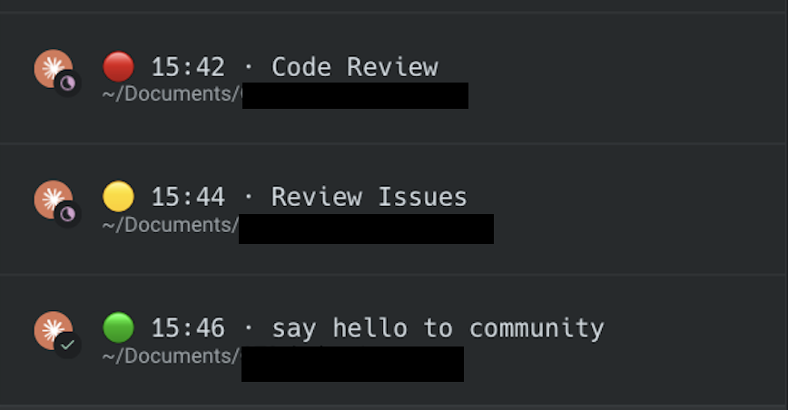

# warp-tab-clock

Puts a live clock in your Warp tab title while you work in Claude Code.



One glance at the tab bar and you know which session wants something from you
(🔴), which is still working (🟡) and which has an answer waiting (🟢) — plus how
long each has been sitting there. The label is either a name you pin yourself or
one derived automatically from what the session is about.

## Requirements

- [Warp](https://warp.dev)
- [Claude Code](https://claude.com/claude-code) **2.1.141 or newer** — older
  versions reject the `terminalSequence` hook output this relies on
- `jq` — needed by the auto-naming hook (`brew install jq`)
- the `claude` CLI on `PATH` — the model-derived label spawns a one-shot headless
  session to get it; without it the pattern-matched label stands
- zsh (Warp's default shell on macOS)

## Install

Two hooks come from a Claude Code plugin. From inside Claude Code:

```
/plugin marketplace add Xoviec/warp-claude-tab-clock
/plugin install warp-tab-clock@xoviec
```

The plugin can't touch your shell, so one more step adds the two environment
variables and the `tabname` helper to `.zshrc`:

```bash
git clone https://github.com/Xoviec/warp-claude-tab-clock.git
cd warp-claude-tab-clock
./setup.sh
```

`setup.sh` is idempotent, backs up `.zshrc` before touching it, and writes
nothing else. If you would rather not run it, paste this into your `.zshrc` by
hand — it is the entire shell side:

```bash
export WARP_DISABLE_AUTO_TITLE=true
export CLAUDE_CODE_DISABLE_TERMINAL_TITLE=1

tabname() {
  local dir="${CLAUDE_CONFIG_DIR:-$HOME/.claude}/warp-tab-name"
  local f="$dir/${WARP_TERMINAL_SESSION_UUID:-default}"
  mkdir -p "$dir"
  if [ $# -eq 0 ]; then
    rm -f "$f" && print -r -- "tabname: cleared"
  else
    print -r -- "$*" > "$f" && print -r -- "tabname: $*"
  fi
}
```

Then two one-off steps:

1. **Clear any manual tab name in Warp.** Right-click the tab → rename → empty
   the field. A manually set name overrides the escape sequence and hides the
   clock completely. This is the single most common reason "nothing happens".
2. **Open a new Warp tab** so the exports are picked up, then run `claude` there.

### Upgrading from the script install

v1 wired the hooks into `~/.claude/settings.json` itself. Run `./teardown.sh`
once to clear those entries, then install the plugin as above.

## Usage

### The dot

The title carries what the session is doing, and the clock is restamped at every
change — so the time is when the state last changed, not only when Claude last
replied. Same label, three states:

```
🟡 14:32 · Fix #2321      a turn is running
🔴 14:33 · Fix #2321      Claude wants a permission decision from you
🟢 14:41 · Fix #2321      the answer has landed
```

Warp has no way to colour a tab from a running program — [tab colours come from
Tab Configs](https://docs.warp.dev/terminal/windows/tab-configs/) and are fixed
when the tab opens, and the requests to script them
([#6897](https://github.com/warpdotdev/warp/issues/6897),
[#2743](https://github.com/warpdotdev/warp/issues/2743)) are unimplemented. The
title is the one part of the tab a program owns, so the state goes there.

Turn it off for the clock and the label alone:

```
/plugin configure warp-tab-clock@xoviec    # "Colour the tab by what the session is doing" → off
```

or `export WARP_TAB_CLOCK_NO_STATE=1` without the plugin.

### The label

The label is resolved on every reply, first match wins:

| Priority | Source | Set by |
|---|---|---|
| 1 | `<state>/<tab-uuid>` | `tabname "My label"` |
| 2 | `<state>/<tab-uuid>.auto` | what the session is about, derived automatically |
| 3 | `<state>/default` | you, for a global fallback |
| 4 | the plugin's **Default tab label** option | `/plugin configure warp-tab-clock@xoviec` |
| 5 | project directory name | nothing — this is the fallback |

`<state>` is `${CLAUDE_CONFIG_DIR:-$HOME/.claude}/warp-tab-name`.

Pin a name for the current tab:

```bash
tabname "Invoice export"     # -> "00:32 · Invoice export"
tabname                      # clear, fall back to auto-naming
```

Set a fallback for every tab that has no name of its own:

```bash
echo "ACME" > ~/.claude/warp-tab-name/default
```

`tabname` is a zsh function, so it only exists in tabs opened after setup. To
rename the tab of a session that is already running, write the file directly:

```bash
echo "New label" > ~/.claude/warp-tab-name/$WARP_TERMINAL_SESSION_UUID
```

### Auto-naming

A `UserPromptSubmit` hook names the tab after the work, not after the prompt
verbatim: `Code review #2121`, `Fix #2321`. The label lands in two steps — one
pattern-matched out of the prompt the moment it is submitted, then a topic from a
model a few seconds later. Two things go into the first one.

**The kind** comes from the verbs in the prompt — review, fix, refactor, test,
docs, release, or feature — recognised in English and Polish. **The ref** is a
`#2121` or an issue key like `PROJ-123` in the prompt; when the prompt has none,
it is parsed out of the current git branch, so `fix/2321-crash` also gives
`#2321` and `bugfix/proj-77-x` gives `PROJ-77`.

| Prompt | Branch | Label |
|---|---|---|
| `zrób code review #2121` | any | `Code review #2121` |
| `napraw ten bug` | `fix/2321-crash` | `Fix #2321` |
| `dodaj dark mode` | `main` | `Feat: dodaj dark mode` |
| `co tu się dzieje` | `main` | `co tu się dzieje` |

With no ref the kind prefixes the prompt, unless the prompt already says it —
`Fix the invoice export` is not turned into `Fix: Fix the invoice export`. With
neither, the prompt stands on its own, collapsed to one line and truncated to 28
characters.

**A session you open with a command is named after the command.** The work is
what the command does, so `/review-summary https://github.com/acme/app/pull/12`
gives `Review summary` — the arguments never reach the title, which keeps URLs
and pasted context out of it. Namespaced commands use their leaf, so
`/xoviec:review-summary` reads the same, and a `#2121` among the arguments is
still picked up as a ref. Commands that only operate Claude Code — `/clear`,
`/login`, `/plugin` and their like — name nothing and leave the tab as it was.
A command already names the topic, so this path skips the model call below.

**The topic comes from a model.** Everything above is pattern-matched out of the
prompt's own words, and those say how the work was asked for rather than what it
is about — `przejrzyj szybko moje repo fe` is a poor tab title, and so is every
label in the table above. They are the placeholder. A one-shot headless Claude
then rewrites the placeholder into the topic — `Przegląd repo FE` — and the tab
settles a few seconds into the first answer.

It runs only where a label was just written: **once per session**, and again on a
change of ticket, not once per turn. It runs detached, because a
`UserPromptSubmit` hook holds the turn for as long as it lasts. So the cost is
one small model call per session — and **the first line of your first prompt is
sent to the API** to make it. If the `claude` CLI is missing, the call fails, or
it outlasts the timeout, the placeholder stands and nothing else happens.

```
/plugin configure warp-tab-clock@xoviec    # "Let a model name the tab" → off
```

or `export WARP_TAB_CLOCK_NO_LLM_NAME=1` without the plugin. Two knobs if you
keep it: `WARP_TAB_CLOCK_LLM_MODEL` (default `haiku`) and
`WARP_TAB_CLOCK_LLM_TIMEOUT` (default `25`, seconds).

**Renaming follows the ref.** The label is set on the first prompt of a session
and then replaced only when the ref changes — you move to another ticket, or
switch branch. A follow-up like "add a test" carries no ref and leaves the title
alone, so it does not flicker on every message. Starting a new Claude session in
the same tab always renames.

**Whatever is derived ends up on your screen.** Tab titles show in screenshots,
screen shares and recordings, and Warp keeps them in its own history database, so
a label outlives the session that produced it. A prompt with no recognised kind
and no ref is used verbatim, and with the model naming on the prompt also leaves
the machine, so if what you type tends to name a client or an unreleased project,
turn auto-naming off — that switch covers the model call too:

```
/plugin configure warp-tab-clock@xoviec    # "Derive labels from the first prompt" → off
```

or, without the plugin, `export WARP_TAB_CLOCK_NO_AUTONAME=1`. Pinned names,
the default label and the project directory name still work.

Saved names are not garbage-collected: `<state>` keeps one file per Warp tab you
have ever used. `rm -rf ~/.claude/warp-tab-name` is safe at any time, and
`./teardown.sh` does it for you.

## How it works

Claude Code hooks, no daemon and no polling. `warp-tab-time.sh` resolves the
label and emits `OSC 0` (`ESC ] 0 ; <title> BEL`); the state it paints comes from
which event called it:

| Event | Runs | State |
|---|---|---|
| `UserPromptSubmit` | `warp-tab-autoname.sh`, which names the tab and then stamps it | 🟡 |
| `PermissionRequest`, `Notification` (`permission_prompt`) | `warp-tab-time.sh waiting` | 🔴 |
| `PostToolUse` | `warp-tab-time.sh working --from waiting` | 🟡 |
| `Stop` | `warp-tab-time.sh ready` | 🟢 |

`PostToolUse` is what returns the tab to 🟡 once a permission has been granted.
It fires after every tool call, dozens per turn, so `--from waiting` makes it
read one file and leave unless the tab is actually still red.

The model naming makes the `UserPromptSubmit` hook recursive: the headless Claude
it spawns runs these same hooks. Both scripts bail on `WARP_TAB_CLOCK_CHILD=1`,
which the spawn sets on the child's environment, so the child neither forks again
nor stamps the tab with its own working directory. It is also started from a
neutral directory, to keep it off the project's `CLAUDE.md` and settings.

Claude Code cannot write to `/dev/tty` from a hook subprocess, so the escape
sequence is returned as JSON instead:

```json
{"terminalSequence":"\u001b]0;00:32 · Invoice export\u0007"}
```

Claude Code validates it against an allowlist (`OSC 0/1/2/9/99/777` plus `BEL`)
and writes it to the terminal itself. Every hook's sequence is emitted
separately, so this coexists with other hooks — including Warp's own
`claude-code-warp` plugin, which sends `OSC 777` notifications on the same
event.

Two environment variables keep other parties from overwriting the title:

- `CLAUDE_CODE_DISABLE_TERMINAL_TITLE=1` — stops Claude Code from setting its
  own title.
- `WARP_DISABLE_AUTO_TITLE=true` — stops the `precmd`/`preexec` hooks Warp
  injects into zsh from resetting the title to the working directory on every
  prompt. This is Warp's own documented escape hatch for exactly this problem.

Both are read from the shell environment. `CLAUDE_CODE_DISABLE_TERMINAL_TITLE`
also works under the `env` key in `settings.json` if you prefer it there.

## Limitations

- **Warp's manual tab rename wins.** If you rename a tab through Warp's UI, that
  name is displayed and nothing this tool emits is visible. The live value is
  also unreadable from outside — Warp persists it to its SQLite database lazily,
  so what is on disk lags behind what is on screen. Renaming a tab
  programmatically is not possible either: Warp's action API does expose
  `tab.rename`, but the local-control server that would accept it is disabled
  and has no public setting to turn it on.
- **Tab colors are not configurable from here.** Warp stores a tab color as a
  closed enum (`Unassigned | Color(<name>)`), so only its named colors exist —
  no custom hex, from any channel.
- **Warp's directory-based tab naming is off** once `WARP_DISABLE_AUTO_TITLE` is
  set. That is the trade: you get your own title, you lose the automatic one.
  It applies to every tab, not just Claude Code sessions.
- **Two of the Claude Code details here are undocumented.** Neither
  `CLAUDE_CODE_DISABLE_TERMINAL_TITLE` nor `CLAUDE_CODE_VERSION` appears in the
  published environment-variable reference, and `terminalSequence` is new in
  2.1.141. They work today; a future release could change them.
- **It makes one model call per session** — the topic in the tab title comes from
  a headless Claude, so the first line of the first prompt goes to the API. Off
  with one option, and the pattern-matched label takes over; see
  [Auto-naming](#auto-naming).
- macOS/zsh only as written. The hooks themselves are portable; the shell wiring
  is not.

## Troubleshooting

**Title never changes.** Almost always a manual tab name. Right-click the tab →
rename → clear it.

**Title flashes and reverts to the directory.** `WARP_DISABLE_AUTO_TITLE` is not
set in that shell. It only applies to tabs opened after setup.

**Title flashes and reverts to something Claude Code wrote.**
`CLAUDE_CODE_DISABLE_TERMINAL_TITLE` is not reaching Claude Code. Move it from
`.zshrc` into `~/.claude/settings.json`:

```json
{ "env": { "CLAUDE_CODE_DISABLE_TERMINAL_TITLE": "1" } }
```

**Auto-naming does nothing.** Check `jq` is installed, and that auto-naming is
not switched off in `/plugin configure warp-tab-clock@xoviec`. Without `jq` the
hook exits silently and the label falls back to the project directory name.

**The label changes on its own a few seconds in.** That is the model naming
replacing the pattern-matched placeholder, once per session. Keep the placeholder
with `WARP_TAB_CLOCK_NO_LLM_NAME=1`, or the "Let a model name the tab" option.

**Check what the hook would emit** — this prints the JSON without touching the
terminal:

```bash
./scripts/warp-tab-time.sh
```

**Confirm Warp honours the sequence at all** — run this in a plain Warp tab, not
through Claude Code (Claude Code captures stdout, so the sequence never reaches
the terminal):

```bash
printf '\033]0;ZZZ-TEST\007'
```

If the tab does not read `ZZZ-TEST`, the problem is Warp's configuration, not
this tool.

## Uninstall

```
/plugin uninstall warp-tab-clock@xoviec
```

```bash
./teardown.sh
```

`teardown.sh` removes the `.zshrc` block, the saved tab names, and any leftovers
from a v1 script install. Open a new tab afterwards to get Warp's
directory-based names back.

## Development

```bash
./tests/test-hooks.sh              # hooks, against a throwaway config dir
claude plugin validate . --strict  # manifests
```

## License

MIT
